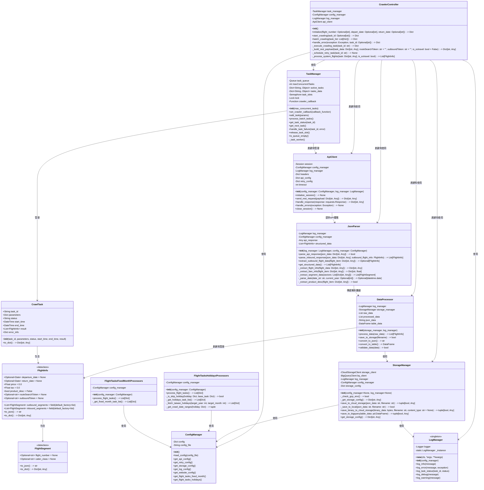

# 易遊網機票資料爬蟲系統 - 類別圖

## 類別圖概述

本文件描述易遊網機票資料爬蟲系統的類別設計。類別圖展示了系統中各個類別的結構、職責以及它們之間的關係，為系統實現提供了藍圖。

## Mermaid 類別圖代碼

## 類別職責詳細說明

### 1. 控制與管理類

#### `CrawlerController`（爬蟲控制器）
- **職責**：作為系統的主要入口點，協調整個爬蟲流程，管理任務執行
- **主要方法**：
  - `__init__()`: 初始化爬蟲控制器，載入配置、初始化日誌和任務管理器。
  - `initialize(flight_number: Optional[str] = None, depart_date: Optional[str] = None, return_date: Optional[str] = None) -> Dict`: 初始化爬蟲參數並創建一個新任務。
  - `start_crawling(task_id: Optional[str] = None) -> Dict`: 開始單個爬蟲任務，如果未提供 task_id，則執行隊列中的下一個任務。
  - `batch_crawling(task_list: List[Dict]) -> Dict`: 批次執行多個爬蟲任務。
  - `handle_error(exception: Exception, task_id: Optional[str] = None) -> Dict`: 處理錯誤情況，並根據配置執行重試邏輯。
  - `_execute_crawling_task(task_id: str) -> Dict`: 執行單個爬蟲任務（由任務管理器回調），包括API請求、解析和數據處理。
  - `_build_rest_payload(task_data: Dict[str, Any], routeSearchToken: str = "", outboundToken: str = "", is_eztravel: bool = False) -> Dict[str, Any]`: 根據任務數據構建 RESTful API 查詢參數。
  - `_schedule_retry_task(task_id: str) -> None`: 安排任務重試，將任務重新加入隊列。
  - `_process_system_flights(task: Dict[str, Any], is_eztravel: bool) -> List[FlightInfo]`: 處理單一系統（eztravel 或 ct）的完整航班查詢流程，包括去程查詢、解析，以及針對每個去程航班查詢和組合回程航班，最終返回該系統的所有有效航班組合。
- **關聯**：
  - 使用 `TaskManager` 管理爬蟲任務
  - 使用 `ConfigManager` 獲取配置信息
  - 使用 `LogManager` 記錄系統日誌
  - 創建和使用 `ApiClient` 發送API請求
  - 創建和使用 `JsonParser` 解析API響應
  - 創建和使用 `StorageManager` 存儲數據
  - 創建和使用 `DataProcessor` 處理數據

#### `TaskManager`（任務管理器）
- **職責**：管理爬蟲任務隊列，控制並行任務數量，確保系統資源合理利用
- **主要屬性**：
  - `task_queue`: 任務隊列，存儲待執行的任務
  - `maxConcurrentTasks`: 最大並行任務數，設定為4
  - `active_tasks`: 當前活動的任務字典，鍵為任務ID，值為任務參數
  - `tasks_data`: 所有任務數據字典，包括已完成的任務
  - `task_slots`: 信號量，用於控制並行任務數
  - `lock`: 線程鎖，用於同步訪問共享資源
  - `crawler_callback`: 爬蟲控制器回調函數
- **主要方法**：
  - `__init__(max_concurrent_tasks)`: 初始化任務管理器，設置最大並行任務數
  - `set_crawler_callback(callback_function)`: 設置爬蟲控制器回調函數
  - `add_task(params)`: 添加新任務到隊列
  - `process_batch_tasks()`: 處理批量任務
  - `get_task_status(task_id)`: 獲取任務狀態
  - `get_next_task()`: 獲取隊列中的下一個任務
  - `handle_task_failure(task_id, error)`: 處理任務失敗
  - `release_task_slot()`: 釋放任務槽位，允許執行下一個任務
  - `is_queue_empty()`: 檢查隊列是否為空
  - `_task_worker()`: 任務工作線程函數
- **關聯**：
  - 創建和管理 `ApiClient` 實例
  - 管理 `CrawlTask` 對象

### 2. API客戶端與除錯類

#### `ApiClient`（API客戶端）
- **職責**：負責發送 REST API 請求並處理響應，與易遊網的 API 進行互動。
- **主要屬性**：
  - `session`: Requests庫的Session實例，用於發送HTTP請求
  - `config_manager`: 配置管理器實例 (ConfigManager)
  - `log_manager`: 日誌管理器實例 (LogManager)
  - `headers`: API 請求標頭 (Dict[str, str])
  - `api_config`: API 相關配置 (Dict)，從配置管理器獲取
  - `retry_config`: 重試相關配置 (Dict)，從配置管理器獲取
  - `timeout`: 請求超時時間 (int)
- **主要方法**：
  - `__init__(config_manager, log_manager)`: 初始化API客戶端，設置配置管理器和日誌管理器。
  - `initialize_session() -> None`: 初始化HTTP會話，設置請求標頭、超時等。
  - `send_rest_request(payload) -> Dict[str, Any]`: 發送 REST API 請求到易遊網端點。
  - `handle_response(response) -> Dict[str, Any]`: 處理API響應，檢查狀態碼和返回數據。
  - `handle_errors(exception) -> None`: 處理請求過程中的錯誤和異常。
  - `close_session() -> None`: 關閉HTTP會話，釋放資源。
- **關聯**：
  - 向 `JsonParser` 提供API響應數據

### 3. 數據處理類

#### `JsonParser`（JSON解析器）
- **職責**：解析易遊網 REST API 返回的 JSON 數據，提取機票資料。
- **主要屬性**：
  - `log_manager`: 日誌管理器實例，用於記錄解析過程中的信息 (LogManager)
  - `config_manager`: 配置管理器實例，用於獲取解析配置 (ConfigManager)
  - `api_response`: API 返回的原始 JSON 數據 (Dict[str, Any] 或 Any)
  - `structured_data`: 結構化後的航班數據列表 (List[FlightInfo])
- **主要方法**：
  - `__init__(log_manager: LogManager, config_manager: ConfigManager)`: 初始化JSON解析器
  - `parse_api_response(json_data: Dict[str, Any]) -> bool`: 解析API返回的JSON數據(主要用於去程)
  - `parse_inbound_response(json_data: Dict[str, Any], outbound_flight_info: FlightInfo) -> List[FlightInfo]`: 解析回程API響應並與去程關聯
  - `extract_outbound_flight_data(flight_item: Dict[str, Any]) -> Optional[FlightInfo]`: 從航班項目數據中提取去程航班信息
  - `get_structured_data() -> List[FlightInfo]`: 獲取結構化的數據 (通常是去程航班列表)
  - `_extract_flight_info(flight_data: Dict[str, Any]) -> Dict[str, Any]`: 提取航班基本信息
  - `_extract_fare_info(flight_item: Dict[str, Any]) -> Dict[str, float]`: 根據 seats 欄位提取票價和稅金信息
  - `_extract_segment_data(sectors: List[Dict[str, Any]]) -> List[FlightSegment]`: 提取航段數據
  - `_parse_date(date_str: str, current_year: Optional[int]) -> Optional[datetime.date]`: 解析日期字符串
- **關聯**：
  - 向 `DataProcessor` 傳遞解析後的數據

#### `DataProcessor`（數據處理器）
- **職責**：處理和轉換爬取的數據，準備存儲
- **主要屬性**：
  - `log_manager`: 日誌管理器實例
  - `storage_manager`: 存儲管理器實例
  - `raw_data`: 原始數據
  - `processed_data`: 處理後的數據
  - `json_data`: JSON格式數據
  - `table_data`: 表格格式數據
- **主要方法**：
  - `__init__(storage_manager, log_manager)`: 初始化數據處理器
  - `process_data(raw_data) -> List[FlightInfo]`: 處理原始數據並返回處理後的數據
  - `save_to_storage(filename) -> bool`: 將數據保存到存儲系統
  - `convert_to_json() -> str`: 轉換為JSON格式
  - `convert_to_table() -> DataFrame`: 轉換為表格格式
  - `validate_data(data) -> bool`: 驗證數據完整性
- **關聯**：
  - 使用 `StorageManager` 存儲數據
  - 創建和管理 `FlightInfo` 對象

### 4. 存儲管理類

#### `StorageManager`（存儲管理器）
- **職責**：管理數據存儲操作，與Cloud Storage和BigQuery交互，提供本地存儲作為備份方案
- **主要屬性**：
  - `storage_client`: Google Cloud Storage客戶端實例，用於操作雲端存儲
  - `bq_client`: Google BigQuery客戶端實例，用於操作BigQuery資料庫
  - `log_manager`: 日誌管理器實例，用於記錄存儲操作日誌
  - `config_manager`: 配置管理器實例，用於獲取存儲相關配置
  - `storage_config`: 存儲配置字典，包含Cloud Storage和BigQuery的配置信息
- **主要方法**：
  - `__init__(config_manager=None, log_manager=None)`: 初始化存儲管理器，設置各種客戶端和配置
  - `_check_gcp_env() -> bool`: 檢查是否在Google Cloud環境中運行，用於判斷是否可以使用GCP服務
  - `_get_storage_config() -> Dict[str, Any]`: 獲取存儲配置，優先從配置管理器獲取
  - `save_to_cloud_storage(json_data: str, filename: str) -> tuple[bool, Any]`: 保存JSON數據到Cloud Storage，失敗時自動回退到本地存儲
  - `_save_to_local(json_data: str, filename: str) -> bool`: 將數據存儲到本地檔案系統作為備份方案
  - `save_to_bigquery(table_data: pd.DataFrame) -> tuple[bool, Any]`: 保存表格數據到BigQuery，失敗時自動回退到本地存儲
  - `save_binary_to_cloud_storage(binary_data: bytes, filename: str, content_type: str = None) -> tuple[bool, Any]`: 保存二進制數據到Cloud Storage
  - `get_storage_config() -> Dict[str, Any]`: 獲取當前的存儲配置信息
- **關聯**：
  - 使用 `ConfigManager` 獲取存儲配置信息
  - 使用 `LogManager` 記錄存儲操作和錯誤日誌
  - 被 `DataProcessor` 使用來執行數據存儲操作

### 5. 任務生成處理器類

#### `FlightTasksHolidaysProcessors`（節日爬蟲任務處理器）
- **職責**：根據配置文件中定義的基礎航線任務和目標月份，結合從外部API獲取的台灣國定假日資訊，動態生成具體的航班爬取任務。處理邏輯包含計算目標年月份、獲取節假日、根據節假日類型和星期決定實際的爬取日期範圍（例如，提前幾天或延後幾天），並處理特定節日（如開國紀念日、春節）的特殊日期規則，以及一個跳過特定日期組合的邏輯（`_is_skip_holiday`）。
- **主要屬性**：
  - `config_manager`: 配置管理器實例 (`ConfigManager`)，用於獲取節日任務的基礎配置。
- **主要方法**：
  - `__init__(config_manager: ConfigManager)`: 初始化節日爬蟲任務處理器。
  - `process_flight_tasks() -> List[Dict]`: 處理並生成所有節日相關的爬蟲任務列表。
  - `_is_skip_holiday(holiday: Dict, base_task: Dict) -> bool`: 判斷是否根據特定規則（例如節日日期與固定月份任務的日期重疊）跳過當前節假日的處理。
  - `_get_holidays_task_list() -> List[Dict]`: 從配置管理器獲取節日爬蟲的基礎任務列表。
  - `_fetch_taiwan_holidays(target_year: int, target_month: int) -> List[Dict]`: 從外部API獲取指定年月的台灣官方節假日數據。
  - `_get_crawl_date_ranges(holiday: Dict) -> tuple`: 根據節假日信息（如描述、星期）決定爬取的出發和返回日期範圍。
- **關聯**：
  - 使用 `ConfigManager` 獲取配置信息。

#### `FlightTasksFixedMonthProcessors`（固定月份日期爬蟲任務處理器）
- **職責**：根據配置文件中定義的基礎航線任務和指定的未來月份及日期（日），生成具體的航班爬取任務。處理邏輯包括計算目標年月份，並將配置中的相對日期（例如下下個月的5號到10號）轉換為絕對的出發和返回日期。
- **主要屬性**：
  - `config_manager`: 配置管理器實例 (`ConfigManager`)，用於獲取固定月份任務的基礎配置。
- **主要方法**：
  - `__init__(config_manager: ConfigManager)`: 初始化固定月份日期爬蟲任務處理器。
  - `process_flight_tasks() -> List[Dict]`: 處理並生成所有固定月份日期相關的爬蟲任務列表。
  - `_get_fixed_month_task_list() -> List[Dict]`: 從配置管理器獲取固定月份日期爬蟲的基礎任務列表。
- **關聯**：
  - 使用 `ConfigManager` 獲取配置信息。